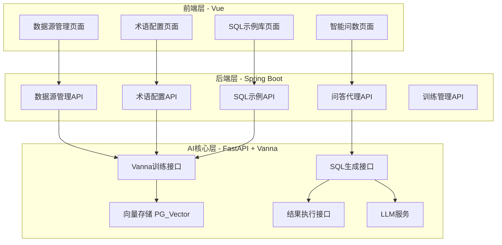
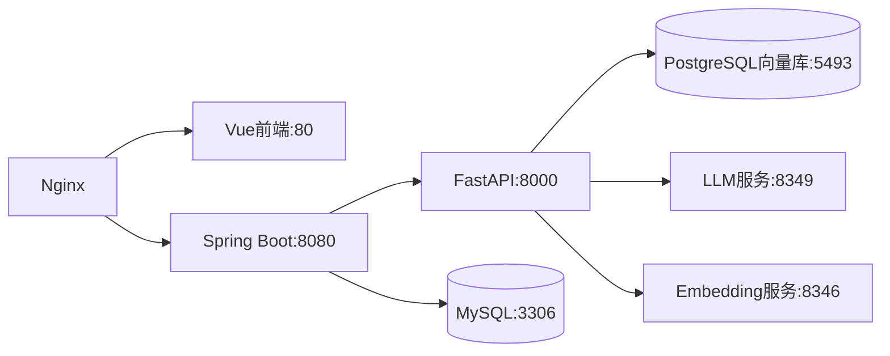

# 智能问数系统技术设计方案

基于用户需求图片，设计一个包含数据源管理、术语配置、SQL示例库和智能问数功能的系统。

## 系统架构

### 三层架构设计



## 核心功能模块

### 1. 数据源管理模块

**功能**：配置数据源连接，完成表结构的初始化训练

**技术实现**：

- Vue页面：数据源列表、新增/编辑表单、测试连接
- Spring Boot：数据源CRUD、连接测试
- FastAPI：调用 `vn.connect_to_mysql()`，执行 DDL 训练

### 2. 训练数据管理模块

**功能**：管理4种类型的训练数据，每种训练数据独立管理并关联到Vanna向量库

**四种训练类型**：

#### 2.1 DDL训练（train_ddl表）

- 让系统了解数据库表结构、列名、数据类型
- 调用：`vn.train(ddl="CREATE TABLE ...")`
- 存储 `vanna_vector_id` 用于关联向量库

#### 2.2 文档训练（train_documentation表）

- 业务术语、行业知识、数据库说明
- 调用：`vn.train(documentation="...")`
- 分类管理：database/business/industry

#### 2.3 SQL训练（train_sql表）

- 常用SQL查询模式
- 调用：`vn.train(sql="SELECT ...")`
- 帮助系统理解SQL编写规范

#### 2.4 问答对训练（train_qa_pair表）

- 自然语言问题与SQL的对应关系
- 调用：`vn.train(question="...", sql="...")`
- 最有效的训练方式

**技术实现**：

- Vue页面：4个独立的训练数据管理页面
- Spring Boot：训练数据CRUD，调用FastAPI训练接口
- FastAPI：执行训练并返回 `vanna_vector_id`

### 3. SQL示例库模块

**功能**：管理和训练SQL问答对（对应 train_qa_pair 表）

**技术实现**：

- Vue页面：SQL示例列表、新增/编辑、批量导入
- Spring Boot：SQL示例CRUD
- FastAPI：调用 `vn.train(question="...", sql="...")`，返回并保存 `vanna_vector_id`

### 4. 智能问数模块

**功能**：自然语言问答，生成SQL、执行查询、展示结果（表格/图表）、历史记录

**技术实现**：

- Vue页面：对话界面、结果展示（表格/Echarts图表）、历史记录
- Spring Boot：问答会话管理、历史记录存储
- FastAPI：
  - `vn.generate_sql(question)` - 生成SQL
  - `vn.run_sql(sql)` - 执行查询
  - 支持连续对话、上下文记忆

## 技术栈详细规范

### 前端 - Vue 3

- **框架**: Vue 3 + TypeScript
- **UI组件**: Element Plus / Ant Design Vue
- **状态管理**: Pinia
- **HTTP客户端**: Axios
- **图表库**: Apache ECharts
- **代码编辑器**: Monaco Editor (SQL编辑)

### 后端 - Spring Boot

- **版本**: Spring Boot 3.x
- **数据库**: MySQL 8.0+ (业务数据) + PostgreSQL (向量数据库)
- **ORM**: MyBatis Plus
- **API文档**: Springdoc OpenAPI
- **HTTP客户端**: RestTemplate / WebClient (调用FastAPI)

### AI核心 - FastAPI + Vanna

- **框架**: FastAPI
- **AI引擎**: 复用 `main.py` 中的 `MyVanna` 类
- **向量存储**: PG_VectorStore
- **LLM**: OpenAI兼容接口 (qwen3-coder-30b)
- **Embedding**: bge-m3

## API设计

### Spring Boot API接口

#### 数据源管理

- `POST /api/datasource` - 创建数据源并训练DDL
- `GET /api/datasource` - 获取数据源列表
- `PUT /api/datasource/{id}` - 更新数据源
- `DELETE /api/datasource/{id}` - 删除数据源
- `POST /api/datasource/{id}/test` - 测试连接
- `POST /api/datasource/{id}/train` - 训练表结构

#### 训练数据管理（4种训练类型）

**DDL训练**

- `POST /api/train/ddl` - 新增并训练DDL
- `GET /api/train/ddl` - 获取DDL训练列表
- `PUT /api/train/ddl/{id}` - 更新DDL
- `DELETE /api/train/ddl/{id}` - 删除DDL及向量数据

**文档训练**

- `POST /api/train/documentation` - 新增并训练文档
- `GET /api/train/documentation` - 获取文档训练列表
- `PUT /api/train/documentation/{id}` - 更新文档
- `DELETE /api/train/documentation/{id}` - 删除文档及向量数据

**SQL训练**

- `POST /api/train/sql` - 新增并训练SQL
- `GET /api/train/sql` - 获取SQL训练列表
- `PUT /api/train/sql/{id}` - 更新SQL
- `DELETE /api/train/sql/{id}` - 删除SQL及向量数据

**问答对训练**

- `POST /api/train/qa-pair` - 新增并训练问答对
- `GET /api/train/qa-pair` - 获取问答对列表
- `PUT /api/train/qa-pair/{id}` - 更新问答对
- `DELETE /api/train/qa-pair/{id}` - 删除问答对及向量数据
- `POST /api/train/qa-pair/batch` - 批量导入

#### 智能问数

- `POST /api/chat/ask` - 提问并获取SQL及结果
- `GET /api/chat/history` - 获取历史对话
- `DELETE /api/chat/history/{id}` - 删除历史记录

### FastAPI 核心接口

```python
# 基于 main.py 扩展
from fastapi import FastAPI, HTTPException
from pydantic import BaseModel

app = FastAPI()

class TrainDDLRequest(BaseModel):
    ddl: str
    table_name: str
    description: str = None

class TrainDocRequest(BaseModel):
    documentation: str
    title: str
    category: str  # database/business/industry

class TrainSQLRequest(BaseModel):
    sql: str
    description: str = None

class TrainQAPairRequest(BaseModel):
    question: str
    sql: str
    description: str = None

class AskRequest(BaseModel):
    question: str
    datasource_id: str

@app.post("/api/vanna/train/ddl")
async def train_ddl(request: TrainDDLRequest):
    # 训练并获取向量ID
    vector_id = vn.train(ddl=request.ddl)
    return {
        "status": "success",
        "vanna_vector_id": vector_id
    }

@app.post("/api/vanna/train/doc")
async def train_documentation(request: TrainDocRequest):
    vector_id = vn.train(documentation=request.documentation)
    return {
        "status": "success",
        "vanna_vector_id": vector_id
    }

@app.post("/api/vanna/train/sql")
async def train_sql(request: TrainSQLRequest):
    vector_id = vn.train(sql=request.sql)
    return {
        "status": "success",
        "vanna_vector_id": vector_id
    }

@app.post("/api/vanna/train/qa-pair")
async def train_qa_pair(request: TrainQAPairRequest):
    vector_id = vn.train(question=request.question, sql=request.sql)
    return {
        "status": "success",
        "vanna_vector_id": vector_id
    }

@app.post("/api/vanna/ask")
async def ask_question(request: AskRequest):
    try:
        sql = vn.generate_sql(request.question)
        df = vn.run_sql(sql)
        return {
            "sql": sql,
            "data": df.to_dict(orient='records'),
            "columns": df.columns.tolist()
        }
    except Exception as e:
        raise HTTPException(status_code=500, detail=str(e))
```

## 数据库设计

### MySQL业务库表结构

```sql
-- 数据源表
CREATE TABLE datasource (
    id VARCHAR(32) PRIMARY KEY,
    name VARCHAR(100) NOT NULL,
    type VARCHAR(20) DEFAULT 'mysql',
    host VARCHAR(100),
    port INT,
    database_name VARCHAR(100),
    username VARCHAR(100),
    password VARCHAR(255),
    status TINYINT DEFAULT 1,
    create_time DATETIME,
    update_time DATETIME
);

-- 训练表1：DDL训练数据表
CREATE TABLE train_ddl (
    id VARCHAR(32) PRIMARY KEY,
    datasource_id VARCHAR(32),
    table_name VARCHAR(100) COMMENT '表名',
    ddl_statement TEXT COMMENT 'DDL语句',
    description VARCHAR(500),
    vanna_vector_id VARCHAR(100) COMMENT 'Vanna向量库ID',
    trained TINYINT DEFAULT 0,
    create_time DATETIME,
    update_time DATETIME,
    FOREIGN KEY (datasource_id) REFERENCES datasource(id)
) COMMENT 'DDL训练：让系统了解表、列和数据类型';

-- 训练表2：文档训练数据表
CREATE TABLE train_documentation (
    id VARCHAR(32) PRIMARY KEY,
    category VARCHAR(20) COMMENT '分类：database/business/industry',
    title VARCHAR(200) COMMENT '文档标题',
    content TEXT COMMENT '文档内容',
    vanna_vector_id VARCHAR(100) COMMENT 'Vanna向量库ID',
    trained TINYINT DEFAULT 0,
    create_time DATETIME,
    update_time DATETIME
) COMMENT '文档训练：帮助LLM理解业务、行业术语和上下文';

-- 训练表3：SQL语句训练表
CREATE TABLE train_sql (
    id VARCHAR(32) PRIMARY KEY,
    datasource_id VARCHAR(32),
    sql_statement TEXT COMMENT 'SQL语句',
    description VARCHAR(500) COMMENT '说明',
    vanna_vector_id VARCHAR(100) COMMENT 'Vanna向量库ID',
    trained TINYINT DEFAULT 0,
    create_time DATETIME,
    update_time DATETIME,
    FOREIGN KEY (datasource_id) REFERENCES datasource(id)
) COMMENT 'SQL训练：常用SQL查询模式';

-- 训练表4：问答-SQL对训练表
CREATE TABLE train_qa_pair (
    id VARCHAR(32) PRIMARY KEY,
    datasource_id VARCHAR(32),
    question TEXT COMMENT '自然语言问题',
    sql_statement TEXT COMMENT '对应的SQL语句',
    description VARCHAR(500),
    vanna_vector_id VARCHAR(100) COMMENT 'Vanna向量库ID',
    trained TINYINT DEFAULT 0,
    create_time DATETIME,
    update_time DATETIME,
    FOREIGN KEY (datasource_id) REFERENCES datasource(id)
) COMMENT 'Q&A训练：问答对，最有效的训练方式';

-- 对话历史表
CREATE TABLE chat_history (
    id VARCHAR(32) PRIMARY KEY,
    user_id VARCHAR(32),
    question TEXT,
    generated_sql TEXT,
    result_data LONGTEXT COMMENT 'JSON格式结果',
    success TINYINT DEFAULT 1,
    error_msg TEXT,
    create_time DATETIME
);
```

## 项目目录结构

```
project/
├── frontend/                 # Vue前端
│   ├── src/
│   │   ├── views/
│   │   │   ├── DataSourceManagement.vue
│   │   │   ├── TrainDDL.vue
│   │   │   ├── TrainDocumentation.vue
│   │   │   ├── TrainSQL.vue
│   │   │   ├── TrainQAPair.vue
│   │   │   └── IntelligentQA.vue
│   │   ├── api/
│   │   │   ├── datasource.ts
│   │   │   ├── train.ts
│   │   │   └── chat.ts
│   │   └── components/
│   └── package.json
├── backend/                  # Spring Boot后端
│   ├── src/main/java/
│   │   └── com/example/smartdata/
│   │       ├── controller/
│   │       │   ├── DatasourceController.java
│   │       │   ├── TrainDDLController.java
│   │       │   ├── TrainDocController.java
│   │       │   ├── TrainSQLController.java
│   │       │   ├── TrainQAPairController.java
│   │       │   └── ChatController.java
│   │       ├── service/
│   │       ├── mapper/
│   │       └── entity/
│   │           ├── Datasource.java
│   │           ├── TrainDDL.java
│   │           ├── TrainDocumentation.java
│   │           ├── TrainSQL.java
│   │           ├── TrainQAPair.java
│   │           └── ChatHistory.java
│   └── pom.xml
├── vanna-service/           # FastAPI服务 ✅ 已完成
│   ├── main.py              # 现有Vanna封装
│   ├── api.py               # FastAPI路由
│   ├── models.py            # Pydantic模型
│   └── requirements.txt
└── database/                # 数据库脚本 ✅ 已完成
    └── init.sql             # MySQL初始化脚本
```

## 部署架构



## 实现步骤

1. ✅ **FastAPI服务扩展** - 基于 `main.py` 创建完整的REST API
2. ✅ **数据库初始化** - 创建业务表
3. ⏳ **Spring Boot后端开发** - 实现业务逻辑和数据管理
4. ⏳ **Vue前端开发** - 实现四个核心页面
5. ⏳ **集成测试** - 端到端功能验证
6. ⏳ **部署上线** - Docker容器化部署

## 关键技术要点

### vanna_vector_id 管理机制

**重要性**：`vanna_vector_id` 是业务数据库与Vanna向量库的关联桥梁

**流程**：

1. **训练时**：调用 `vn.train()` 后，Vanna会将数据存入向量库并返回一个唯一ID
2. **存储**：将返回的ID保存到对应训练表的 `vanna_vector_id` 字段
3. **更新时**：先根据 `vanna_vector_id` 删除向量库中的旧数据，再重新训练
4. **删除时**：同时删除MySQL业务表记录和PG向量库中的向量数据

**伪代码示例**：

```python
# Spring Boot调用FastAPI训练
response = restTemplate.post("/api/vanna/train/ddl", ddlRequest)
vector_id = response.get("vanna_vector_id")

# 保存到MySQL
trainDdl.setVannaVectorId(vector_id)
trainDdl.setTrained(1)
trainDdlMapper.insert(trainDdl)
```

### 连续对话支持

在智能问数模块中，需要维护对话上下文：

- Spring Boot维护会话ID
- FastAPI通过会话ID关联历史问题
- 支持"上一个问题的结果中..."等追问

### 图表自动生成

根据查询结果自动判断图表类型：

- 时间序列 → 折线图
- 分类统计 → 柱状图/饼图
- 多维数据 → 组合图表

### 训练数据管理

- 数据源变更时自动重新训练DDL
- 术语更新时增量训练
- SQL示例支持批量训练和验证

## 已完成功能

### ✅ FastAPI 服务层

- 11个REST API接口
- 4种训练数据接口（DDL、文档、SQL、问答对）
- 智能问答接口
- 健康检查接口
- 完整的错误处理和CORS支持

### ✅ 数据库设计

- 6个核心业务表
- 完整的索引和外键约束
- vanna_vector_id 字段设计
- 示例数据

## 待开发功能

### ⏳ Spring Boot 后端

- Entity、Mapper、Service、Controller层
- 与FastAPI的集成
- 业务逻辑实现
- 权限和认证

### ⏳ Vue 前端

- 4个训练数据管理页面
- 智能问数对话界面
- 图表展示（ECharts）
- 历史记录管理

---

**设计日期**: 2025-11-24
**版本**: 1.0
